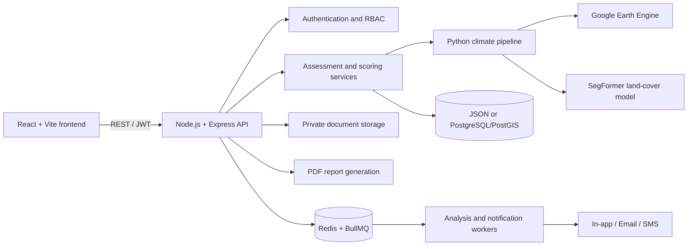

# Urban Climate Intelligence & Decision Support Platform

An MVP decision-support platform for evaluating the climate impact of urban-development projects in Pune, India. The system combines satellite-derived environmental indicators, deterministic engineering calculations, explainable recommendations, and project reporting in one workflow.

> **Project status:** Active MVP development. The backend and climate-scoring workflow are implemented and testable locally. The React interface currently uses mock service responses and is ready to be connected to the API.

## Overview

The platform helps planners and environmental teams assess a proposed site across four climate dimensions:

- **Flood risk** using land-cover data and the SCS Curve Number runoff method.
- **Heat impact** using Land Surface Temperature and Pune-specific baselines.
- **Green-cover pressure** using vegetation, impervious-surface, and water coverage.
- **Embodied carbon** using project material quantities and built-up area.

These results are combined into a transparent climate score, accompanied by data-quality indicators, assumptions, recommendations, optimized scenarios, and downloadable reports.

## System Architecture



The backend is organized as a modular monolith for the MVP. Its service boundaries can later be separated without introducing premature microservice overhead.

## Repository Structure

```text
Pune-Climate-ML/
├── backend/                  # Express API, persistence, workers and tests
│   ├── examples/             # Ready-to-use mock assessment payloads
│   ├── python/               # Node-to-Python ML bridge
│   ├── src/                  # Application source code
│   └── test/                 # API and scoring tests
├── frontend/                 # React + Vite user interface
├── ml_pipeline/              # Extraction, scoring and optimization modules
├── train_segformer.py        # SegFormer training entry point
└── README.md
```

## Technology Stack

| Layer | Technologies |
|---|---|
| Frontend | React 18, Vite, React Router, Recharts, Lucide |
| Backend | Node.js 20+, Express 5, Zod, Pino |
| Authentication | JWT access/refresh tokens, bcrypt, role-based permissions |
| Data | Local JSON for development; PostgreSQL + PostGIS for production |
| Jobs and cache | Redis, BullMQ |
| File storage | Private local storage, AWS S3, or Firebase Storage |
| Climate intelligence | Python, Google Earth Engine, PyTorch, SegFormer |
| Notifications | In-app, SMTP email, Twilio SMS |
| Reports | PDFKit |

## Key Capabilities

- Project assessment creation, retrieval, optimization, and reassessment.
- Deterministic flood, heat, green-cover, carbon, and composite scoring.
- Fixture, request-provided, and Python/GEE-backed ML input modes.
- JWT authentication with rotating, revocable refresh sessions.
- Role permissions for administrators, municipal authorities, planners, consultants, and public viewers.
- Document upload and authenticated download through private storage adapters.
- Redis/BullMQ workers for asynchronous analysis and notification delivery.
- In-app notifications with optional email and SMS channels.
- Dashboard summaries and downloadable PDF assessment reports.
- Rate limiting, request IDs, structured logging, validation, and security headers.

## Quick Start

### Prerequisites

- [Node.js](https://nodejs.org/) 20 or newer
- npm
- Python 3.10 or newer for the real ML pipeline
- Docker Desktop only when using PostgreSQL/PostGIS or Redis locally
- Google Earth Engine access and model weights only when using real ML inference

### 1. Clone the repository

```bash
git clone https://github.com/GitWithEkam/Pune-Climate-ML.git
cd Pune-Climate-ML
```

### 2. Start the backend

```powershell
cd backend
npm install
Copy-Item .env.example .env
npm run dev
```

The API runs at `http://localhost:4000`, with versioned routes under `http://localhost:4000/api/v1`.

For a zero-infrastructure local run, set `REDIS_URL=` in `.env`. This mode uses local persistence, local private file storage, synchronous processing, and deterministic fixture ML data. PostgreSQL, Redis, cloud credentials, and trained model weights are not required.

### 3. Load mock assessments

Keep the backend running, then open another terminal:

```powershell
cd backend
npm run seed
```

Reusable request bodies are available in:

- `backend/examples/mock-assessment.json`
- `backend/examples/mock-assessment-with-ml.json`

### 4. Start the frontend

```powershell
cd frontend
npm install
npm run dev
```

Open `http://localhost:5173`. The interface currently reads from `frontend/src/data/mockData.js`; connect `frontend/src/services/climateApi.js` to the endpoints below to use live backend data.

## API Summary

All protected routes require `Authorization: Bearer <accessToken>`.

| Area | Method | Endpoint |
|---|---:|---|
| Health | `GET` | `/api/health` |
| Authentication | `POST` | `/api/v1/auth/register` |
| Authentication | `POST` | `/api/v1/auth/login` |
| Authentication | `POST` | `/api/v1/auth/refresh` |
| Authentication | `POST` | `/api/v1/auth/logout` |
| Assessments | `POST` | `/api/v1/assessments` |
| Assessments | `GET` | `/api/v1/assessments` |
| Assessments | `GET` | `/api/v1/assessments/:id` |
| Optimization | `POST` | `/api/v1/assessments/:id/optimize` |
| Reassessment | `POST` | `/api/v1/assessments/:id/reassess` |
| Documents | `POST` | `/api/v1/assessments/:id/documents` |
| Documents | `GET` | `/api/v1/assessments/:id/documents/:documentId` |
| Reports | `GET` | `/api/v1/assessments/:id/report` |
| Dashboard | `GET` | `/api/v1/dashboard` |
| Notifications | `GET` | `/api/v1/notifications` |
| Jobs | `GET` | `/api/v1/jobs/:queue/:id` |

For authentication rules, payload details, storage providers, and operational configuration, see the [backend documentation](backend/README.md).

## Climate Intelligence Pipeline

### Satellite and spatial extraction

`ml_pipeline/extractor.py` combines Google Earth Engine data with a fine-tuned SegFormer-B0 model to derive:

- Vegetation, impervious-surface, and water percentages.
- Landsat Land Surface Temperature.
- Copernicus DEM elevation and slope.
- NDVI, NDBI, and NDWI spectral indices.

### Deterministic scoring

`ml_pipeline/scorer.py` calculates the impact components using explicit, reproducible formulas. The current Pune weighting is:

| Component | Weight |
|---|---:|
| Flood | 30% |
| Heat | 30% |
| Green cover | 20% |
| Embodied carbon | 20% |

`impactScore` and component risk scores are pressures, where higher values are worse. `climateScore` is a positive resilience score calculated as `100 - impactScore`, where higher values are better.

### Optimization

`ml_pipeline/optimizer.py` can request structured recommendations from Gemini. Proposed changes are reapplied to the deterministic scorer so that reported improvements are calculated rather than invented by the language model.

## Running with Real ML Data

The backend starts in `fixture` mode for predictable local development. To invoke the Python GEE + SegFormer pipeline:

1. Install the Python packages used by `ml_pipeline/`, including Earth Engine, geemap, NumPy, PyTorch, Transformers, Google Gen AI, Pydantic, and python-dotenv.
2. Authenticate Google Earth Engine locally or configure a service account.
3. Train or provide compatible SegFormer weights.
4. Configure these values in `backend/.env`:

```env
ML_MODE=python
PYTHON_COMMAND=python
GEE_PROJECT_ID=your-project-id
GEE_SERVICE_ACCOUNT=your-service-account-email
GEE_KEY_PATH=path/to/service-account-key.json
MODEL_PATH=../models/segformer-pune
```

5. Include valid Pune coordinates when creating an assessment.

To train the model:

```bash
python train_segformer.py
```

Training requires valid Earth Engine authentication and writes the fine-tuned model artifacts to the configured model directory.

## Optional Infrastructure

From the `backend` directory, start the services you need:

```bash
docker compose up -d database
docker compose up -d redis
```

- Set `STORAGE_DRIVER=postgres` to use PostgreSQL/PostGIS.
- Set `REDIS_URL=redis://localhost:6379` and run `npm run worker` to enable BullMQ processing.
- Set `FILE_STORAGE_PROVIDER=s3` or `firebase` and provide the corresponding credentials for cloud object storage.
- Configure `SMTP_*` or `TWILIO_*` values for external notifications. In-app notifications work without either provider.

Never commit `.env` files, cloud credentials, service-account keys, or trained-model secrets.

## Testing and Verification

Run the backend validation suite from `backend/`:

```bash
npm test
npm run check
```

Build the frontend before submitting UI changes:

```bash
cd frontend
npm run build
```

## Development Notes

- Formula-based scores are the system of record; generative recommendations do not replace them.
- Fixture responses are labeled as development data and should not be presented as measured site results.
- Local JSON persistence is intended for single-process development. Use PostgreSQL when running distributed workers.
- Uploaded files remain private and are served only through authenticated API routes.
- Production deployments should add managed secrets, TLS, database backups, upload malware scanning, and external monitoring.

## Contributing

1. Create a focused feature branch.
2. Keep frontend, backend, and ML changes within their relevant modules.
3. Add or update tests for behavior changes.
4. Run backend checks and the frontend production build.
5. Open a pull request describing the change, verification performed, and any configuration impact.

## Documentation

- [Backend API and operations guide](backend/README.md)
- [Mock assessment payload](backend/examples/mock-assessment.json)
- [Mock assessment with supplied ML output](backend/examples/mock-assessment-with-ml.json)

## Disclaimer

This MVP provides planning and decision-support indicators. Its outputs are not a substitute for statutory environmental clearance, certified engineering analysis, flood modelling, or professional site investigation.
